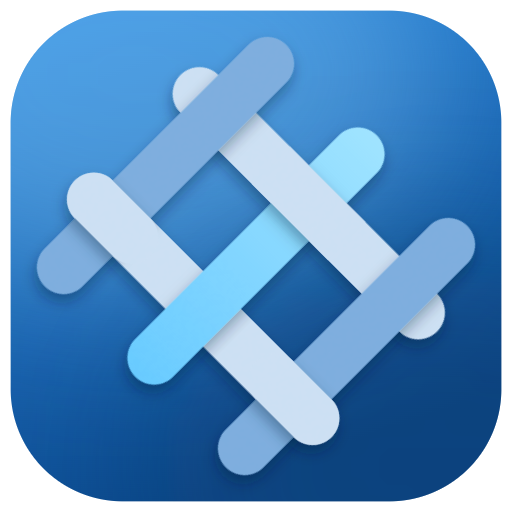

<div align="center">

<picture>
  <source media="(prefers-color-scheme: dark)" srcset="docs/design/icon/png/dark/lattice-512.png">
  
</picture>

# Lattice

**A multi-host BOINC monitoring dashboard.**

[](https://github.com/0x8A63F77D/Lattice/actions/workflows/ci.yml)
[](https://github.com/0x8A63F77D/Lattice/releases)
[](https://dotnet.microsoft.com/)

[](LICENSE)

</div>

Lattice is a cross-platform desktop app that monitors many
[BOINC](https://boinc.berkeley.edu/) hosts from one window — aggregating tasks,
projects, transfers, and event logs across your whole fleet.

It is an open-source alternative to the closed-source, Windows-centric
[BOINCTasks](https://efmer.com/boinctasks/). It is **not** another single-machine
BOINC Manager replacement — that niche is already filled by the official Manager
and Fresco.

Lattice is a GUI RPC **client**. It schedules, downloads, and computes *nothing*.
All real work is done by the official BOINC core client (`boinc` daemon) running
on each host; Lattice connects over TCP and renders the state it reads back.

<!-- TODO(screenshot): add a Tasks-view / shell screenshot once the M2 dashboard
     walkthrough (#32) lands. Deferred until the views are demo-able — do not
     fabricate one before then. -->

## Contents

- [What makes it different](#what-makes-it-different)
- [Status & roadmap](#status--roadmap)
- [Try the alpha](#try-the-alpha)
- [Known limitations](#known-limitations)
- [Build from source](#build-from-source)
- [Solution structure](#solution-structure)
- [Tech stack](#tech-stack)
- [Documentation](#documentation)
- [License](#license)

## What makes it different

- **Multi-host aggregation** — one view over every host, not one window per machine.
- **Data visualization** *(M4)* — credit history, task timelines, per-project throughput.
- **Modern Fluent UI** — an information-dense, scannable monitoring surface built on
  Fluent 2, with light and dark themes from day one.

## Status & roadmap

Lattice is under active development. Milestones track on GitHub:

| Milestone | Scope | Status |
| --------- | ----- | ------ |
| **M1 — Protocol layer** | `Lattice.Boinc.GuiRpc`: connect, frame, auth, `get_state` / `get_cc_status` / `get_results` / `get_messages`, typed models. NuGet-publishable. | ✅ Done |
| **[M2 — Read-only dashboard](https://github.com/0x8A63F77D/Lattice/milestone/1)** | NavigationView shell, per-host state machines, and the read-only views: Tasks (Wave 1), plus Projects / Transfers / Event log (Wave 2). | ✅ Functionally complete |
| **[M3 — Control operations](https://github.com/0x8A63F77D/Lattice/milestone/2)** | Suspend/resume, task abort, project update/attach/detach, run modes, snooze, with confirmation UX. | ✅ Functionally complete |
| **[M4 — Differentiators](https://github.com/0x8A63F77D/Lattice/milestone/3)** | Charts, SSH tunnel manager, host groups, notification surface. | ⏳ Planned |

This alpha covers read-only monitoring (M2) **and** control operations (M3):
suspend/resume, task abort, per-host run modes, snooze, and project
attach/detach/update — all with confirmation prompts on the destructive ones. The
M4 differentiators (charts, a built-in SSH tunnel manager, host groups, desktop
notifications) are **not built yet** — see [Known limitations](#known-limitations).

## Try the alpha

> **Public alpha.** This is an early build for external testers — expect rough
> edges and missing polish. Please
> [report anything that breaks or feels off](https://github.com/0x8A63F77D/Lattice/issues/new/choose).
> Download the latest build from the
> **[Releases page](https://github.com/0x8A63F77D/Lattice/releases)**.

Every artifact is a **self-contained** build with the .NET runtime bundled in, so
there is nothing to install first — download, unpack, and run. The version you are
running is shown in **Settings → About** — quote it when you file a report.

The builds are **unsigned** (no paid code-signing certificates yet), so each OS
shows a one-time trust prompt on first launch. Here's how to get past each:

### Windows — `Lattice-win-x64.zip`

Portable: unzip and run `Lattice.exe`. SmartScreen shows *"Windows protected your
PC"* — click **More info → Run anyway**.

### macOS — `Lattice-osx-arm64.dmg` (Apple Silicon) or `Lattice-osx-x64.dmg` (Intel)

Open the `.dmg` and drag **Lattice** to Applications. The app is ad-hoc signed but
not notarized, so Gatekeeper blocks a plain double-click on first launch. Get past
it once, one of these ways:

- **macOS 15 (Sequoia) and later:** double-click Lattice, dismiss the warning,
  then open **System Settings → Privacy & Security**, scroll down and click
  **Open Anyway** (Apple removed the old right-click shortcut on Sequoia).
- **macOS 14 and earlier:** **right-click (Control-click) the app → Open**, then
  confirm in the dialog.
- **Any version, from Terminal:** clear the quarantine flag outright, then launch
  normally:
  ```sh
  xattr -dr com.apple.quarantine /Applications/Lattice.app
  ```

Full notarization would remove the prompt entirely, but needs a paid Apple
Developer account — deferred past the alpha.

### Linux — `Lattice-x86_64.AppImage` (primary) or `Lattice-<version>-linux-x64.tar.gz`

No signing gate. Mark the AppImage executable and run it — no root, no install:
```sh
chmod +x Lattice-x86_64.AppImage
./Lattice-x86_64.AppImage
```
The AppImage needs FUSE on the host; on a FUSE-less system run it with
`./Lattice-x86_64.AppImage --appimage-extract-and-run`. The tarball is an
unpack-and-`./Lattice` alternative.

### Connect Lattice to a BOINC host

Lattice reads state from a running BOINC **core client** (the `boinc` daemon) — it
schedules and computes nothing itself, so you need BOINC installed and running on
at least one machine.

1. **Add a local host.** Click **＋** in the sidebar and point a host at
   `localhost`, port **31416** (the BOINC default). The RPC password lives in
   `gui_rpc_auth.cfg` in your BOINC data directory — paste it into the dialog.
   Lattice authenticates over the standard challenge-response handshake and starts
   polling.
2. **Watch it populate.** The Tasks, Projects, Transfers, and Event log views fill
   in as Lattice polls. Add more hosts to aggregate several machines in one window.
3. **Control it.** Select a task and use **Suspend / Resume / Abort** in the Tasks
   command bar; the **Computing** dropdown (and the host's right-click menu in the
   sidebar) sets per-host run modes and snooze; right-click a project to update or
   detach, or attach a new one. Destructive actions ask for confirmation first.

### Remote hosts

By default a BOINC daemon only accepts GUI RPC connections from `localhost`. To
manage a host across the network, on **that host** either list the connecting
machine's IP in `remote_hosts.cfg` or set `<allow_remote_gui_rpc>1</allow_remote_gui_rpc>`
in `cc_config.xml`, and make sure its `gui_rpc_auth.cfg` password is set (you enter
it in Lattice's add-host dialog).

> ⚠️ **The GUI RPC protocol has no transport encryption.** The challenge-response
> handshake protects only the password — the session itself (task names, project
> URLs, control commands) travels in the clear. **Do not expose port 31416 to an
> untrusted network.** For anything beyond a trusted LAN, tunnel it:
>
> - **SSH tunnel** — forward the remote port to your machine, then add a host
>   pointing at `localhost:31416`:
>   ```sh
>   ssh -L 31416:localhost:31416 user@remote-host
>   ```
> - **Private overlay network** — a VPN or a mesh like
>   [Tailscale](https://tailscale.com/) puts the host on a private address you can
>   reach directly.
>
> A built-in SSH tunnel manager is planned for M4; until then, set up the tunnel
> or overlay yourself.

## Known limitations

This is an alpha. Known gaps and unverified surfaces a tester is likely to hit:

- **No charts or data visualization yet.** Credit history, task timelines, and
  per-project throughput are the M4 differentiators — not built yet.
- **No built-in SSH tunnel manager yet (M4).** Remote hosts over an untrusted
  network need your own SSH tunnel or VPN/overlay (see [Remote hosts](#remote-hosts)).
- **No host groups or desktop/tray notifications yet (M4).**
- **Windows & Linux tray residency is not hardware-verified**
  ([#116](https://github.com/0x8A63F77D/Lattice/issues/116)). "Close keeps Lattice
  in the tray" and the tray icon's click behaviour were verified on macOS only; the
  Windows and Linux legs are code-complete but untested on real hardware. On Linux,
  close-to-tray is **off by default** and needs a StatusNotifierItem/AppIndicator
  desktop, plus opt-in via **Settings → Tray**.
- **Windows 11 Mica material is unverified on real hardware**
  ([#11](https://github.com/0x8A63F77D/Lattice/issues/11)). Lattice requests Mica on
  Windows 11 and falls back to a solid window colour everywhere else; the Mica path
  itself has only been exercised on macOS/Linux fallbacks, so on Windows 11 it may
  render differently or fall back.
- **Unsigned builds** trip the first-launch OS trust prompts described under
  [Try the alpha](#try-the-alpha).

Found something not listed here? A
[bug report or feedback note](https://github.com/0x8A63F77D/Lattice/issues/new/choose)
is exactly what this alpha is for.

## Build from source

Requires the **.NET 10 SDK**.

```sh
dotnet build            # build the solution
dotnet test             # run the test suites
dotnet run --project src/Lattice.App   # launch the desktop app
```

Packaging the per-platform release artifacts (portable zip, `.dmg`, AppImage,
tarball) is documented in [`packaging/README.md`](packaging/README.md). Connecting
Lattice to a BOINC daemon (local or remote) is covered under
[Try the alpha](#connect-lattice-to-a-boinc-host).

## Solution structure

The BOINC-facing layers are strictly separated from the app so the protocol
client can ship as a standalone NuGet package.

| Project | Lang | Responsibility |
| ------- | ---- | -------------- |
| [`src/Lattice.Boinc.GuiRpc`](src/Lattice.Boinc.GuiRpc) | C# | Protocol layer: connection, framing, auth, RPC ops, strongly-typed models. **Single-host semantics only.** Publishable as the `Lattice.Boinc.GuiRpc` NuGet package. Knows nothing about multiple hosts, polling policy, or the app. |
| [`src/Lattice.Core`](src/Lattice.Core) | C# | Multi-host domain: host registry, polling scheduler, reconnect/backoff, state cache + diff. Depends on GuiRpc — never the reverse. |
| [`src/Lattice.Core.Machine`](src/Lattice.Core.Machine) | F# | Pure decision core for the per-host monitor (`HostMachine.step`). No I/O, no dependencies. |
| [`src/Lattice.App.Aggregation`](src/Lattice.App.Aggregation) | F# | Pure app-side aggregation: parent/child row rollups, status summaries, view-slice projection. No UI or GuiRpc types. |
| [`src/Lattice.App`](src/Lattice.App) | C# | Avalonia UI: views, viewmodels, theming. Contains no protocol logic — ViewModels consume `Lattice.Core`. |

Tests and tooling live alongside:

- `tests/Lattice.Tests`, `tests/Lattice.App.Tests`, `tests/Lattice.Aggregation.Tests` — xUnit suites.
- `tests/Lattice.Verification` — an F# executable spec that drives the production
  `HostMachine.step` directly.
- `verification/HostMonitor.pml` — a [Promela](https://spinroot.com/) model of the
  host monitor, model-checked with SPIN.
- `tools/Lattice.SmokeTest` — console smoke test against a live daemon.

## Tech stack

- **.NET 10** — C#, plus F# for the pure decision/aggregation cores.
- **[Avalonia 12](https://avaloniaui.net/)** + **[FluentAvaloniaUI 3](https://github.com/amwx/FluentAvalonia)** — Fluent 2 theming and WinUI-ported controls (NavigationView, TabView, InfoBar).
- **[CommunityToolkit.Mvvm](https://learn.microsoft.com/dotnet/communitytoolkit/mvvm/)** — source-generated MVVM.
- **xUnit** for unit tests, with an F# executable spec and a Promela/SPIN model
  keeping the `HostMonitor` state machine honest.

## Documentation

Design specs and deep-dives live under [`docs/`](docs/):

- [`docs/design/m2`](docs/design/m2) — M2 read-only dashboard design.
- [`docs/superpowers/specs`](docs/superpowers/specs) and
  [`docs/superpowers/plans`](docs/superpowers/plans) — per-milestone design and
  execution records.

## License

[MIT](LICENSE) © 2026 0x8A63F77D.
