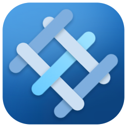

<div align="center">

<picture>
  <source media="(prefers-color-scheme: dark)" srcset="docs/design/icon/png/dark/lattice-256.png">
  
</picture>

# Lattice

**A multi-host BOINC monitoring dashboard.**

[](https://github.com/0x8A63F77D/Lattice/actions/workflows/ci.yml)
[](https://github.com/0x8A63F77D/Lattice/releases)
[](https://dotnet.microsoft.com/)

[](LICENSE)

</div>

Lattice is a cross-platform desktop app that monitors many
[BOINC](https://boinc.berkeley.edu/) hosts from one window — aggregating tasks,
projects, transfers, and event logs across your whole fleet.

It is an open-source alternative to the closed-source, Windows-centric
[BOINCTasks](https://efmer.com/boinctasks/). It is **not** another single-machine
BOINC Manager replacement — that niche is already filled by the official Manager
and Fresco.

Lattice is a GUI RPC **client**. It schedules, downloads, and computes *nothing*.
All real work is done by the official BOINC core client (`boinc` daemon) running
on each host; Lattice connects over TCP and renders the state it reads back.

<!-- TODO(screenshot): add a Tasks-view / shell screenshot once the M2 dashboard
     walkthrough (#32) lands. Deferred until the views are demo-able — do not
     fabricate one before then. -->

## Contents

- [What makes it different](#what-makes-it-different)
- [Status & roadmap](#status--roadmap)
- [Download & install](#download--install)
- [Build from source](#build-from-source)
- [Solution structure](#solution-structure)
- [Tech stack](#tech-stack)
- [Documentation](#documentation)
- [License](#license)

## What makes it different

- **Multi-host aggregation** — one view over every host, not one window per machine.
- **Data visualization** *(M4)* — credit history, task timelines, per-project throughput.
- **Modern Fluent UI** — an information-dense, scannable monitoring surface built on
  Fluent 2, with light and dark themes from day one.

## Status & roadmap

Lattice is under active development. Milestones track on GitHub:

| Milestone | Scope | Status |
| --------- | ----- | ------ |
| **M1 — Protocol layer** | `Lattice.Boinc.GuiRpc`: connect, frame, auth, `get_state` / `get_cc_status` / `get_results` / `get_messages`, typed models. NuGet-publishable. | ✅ Done |
| **[M2 — Read-only dashboard](https://github.com/0x8A63F77D/Lattice/milestone/1)** | NavigationView shell, per-host state machines, and the read-only views: Tasks (Wave 1), plus Projects / Transfers / Event log (Wave 2). | 🚧 In progress |
| **[M3 — Control operations](https://github.com/0x8A63F77D/Lattice/milestone/2)** | Suspend/resume, task abort, project update/attach/detach, snooze, with confirmation UX. | ⏳ Planned |
| **[M4 — Differentiators](https://github.com/0x8A63F77D/Lattice/milestone/3)** | Charts, SSH tunnel manager, host groups, notification surface. | ⏳ Planned |

The current release is **read-only monitoring** (M2); control operations such as
suspend/resume and task abort arrive in M3.

## Download & install

> **Pre-release beta.** The latest build is an early beta
> ([`v0.1.0-beta.3`](https://github.com/0x8A63F77D/Lattice/releases)) — expect
> rough edges. Grab it from the
> **[Releases page](https://github.com/0x8A63F77D/Lattice/releases)**.

Every artifact is a **self-contained** build with the .NET runtime bundled in, so
there is nothing to install first — download, unpack, and run.

The builds are **unsigned** (no paid code-signing certificates yet), so each OS
shows a one-time trust prompt on first launch:

**Windows** — `Lattice-win-x64.zip`
Portable: unzip and run `Lattice.exe`. SmartScreen shows *"Windows protected your
PC"* — click **More info → Run anyway**.

**macOS** — `Lattice-osx-arm64.dmg` (Apple Silicon) or `Lattice-osx-x64.dmg` (Intel)
Open the `.dmg` and drag **Lattice** to Applications. The app is ad-hoc signed but
not notarized, so Gatekeeper blocks a direct double-click. **Right-click the app →
Open**, then confirm. Alternatively, clear the quarantine attribute:
```sh
xattr -dr com.apple.quarantine /Applications/Lattice.app
```

**Linux** — `Lattice-x86_64.AppImage` (primary) or `Lattice-<version>-linux-x64.tar.gz`
Mark the AppImage executable and run it — no root, no install:
```sh
chmod +x Lattice-x86_64.AppImage
./Lattice-x86_64.AppImage
```
The AppImage needs FUSE on the host; on a FUSE-less system run it with
`./Lattice-x86_64.AppImage --appimage-extract-and-run`. The tarball is an
unpack-and-`./Lattice` alternative.

Once running, [point Lattice at a BOINC daemon](#pointing-lattice-at-a-boinc-daemon).

## Build from source

Requires the **.NET 10 SDK**.

```sh
dotnet build            # build the solution
dotnet test             # run the test suites
dotnet run --project src/Lattice.App   # launch the desktop app
```

Packaging the per-platform release artifacts (portable zip, `.dmg`, AppImage,
tarball) is documented in [`packaging/README.md`](packaging/README.md).

### Pointing Lattice at a BOINC daemon

Lattice talks to a running BOINC core client over the GUI RPC protocol:

- Default endpoint is TCP port **31416**.
- The RPC password is generated per host in `gui_rpc_auth.cfg`, found in the
  BOINC data directory. Lattice authenticates with it via the standard
  challenge-response handshake.

### Remote hosts

By default a BOINC daemon only accepts GUI RPC connections from `localhost`. To
manage a host across the network you must either list the client IP in
`remote_hosts.cfg` or set `allow_remote_gui_rpc` in `cc_config.xml`.

> ⚠️ **The GUI RPC protocol has no transport encryption.** The challenge-response
> handshake protects only the password, not the session. For cross-network
> management, tunnel the connection over SSH. A built-in tunnel manager is
> planned for M4.

## Solution structure

The BOINC-facing layers are strictly separated from the app so the protocol
client can ship as a standalone NuGet package.

| Project | Lang | Responsibility |
| ------- | ---- | -------------- |
| [`src/Lattice.Boinc.GuiRpc`](src/Lattice.Boinc.GuiRpc) | C# | Protocol layer: connection, framing, auth, RPC ops, strongly-typed models. **Single-host semantics only.** Publishable as the `Lattice.Boinc.GuiRpc` NuGet package. Knows nothing about multiple hosts, polling policy, or the app. |
| [`src/Lattice.Core`](src/Lattice.Core) | C# | Multi-host domain: host registry, polling scheduler, reconnect/backoff, state cache + diff. Depends on GuiRpc — never the reverse. |
| [`src/Lattice.Core.Machine`](src/Lattice.Core.Machine) | F# | Pure decision core for the per-host monitor (`HostMachine.step`). No I/O, no dependencies. |
| [`src/Lattice.App.Aggregation`](src/Lattice.App.Aggregation) | F# | Pure app-side aggregation: parent/child row rollups, status summaries, view-slice projection. No UI or GuiRpc types. |
| [`src/Lattice.App`](src/Lattice.App) | C# | Avalonia UI: views, viewmodels, theming. Contains no protocol logic — ViewModels consume `Lattice.Core`. |

Tests and tooling live alongside:

- `tests/Lattice.Tests`, `tests/Lattice.App.Tests`, `tests/Lattice.Aggregation.Tests` — xUnit suites.
- `tests/Lattice.Verification` — an F# executable spec that drives the production
  `HostMachine.step` directly.
- `verification/HostMonitor.pml` — a [Promela](https://spinroot.com/) model of the
  host monitor, model-checked with SPIN.
- `tools/Lattice.SmokeTest` — console smoke test against a live daemon.

## Tech stack

- **.NET 10** — C#, plus F# for the pure decision/aggregation cores.
- **[Avalonia 12](https://avaloniaui.net/)** + **[FluentAvaloniaUI 3](https://github.com/amwx/FluentAvalonia)** — Fluent 2 theming and WinUI-ported controls (NavigationView, TabView, InfoBar).
- **[CommunityToolkit.Mvvm](https://learn.microsoft.com/dotnet/communitytoolkit/mvvm/)** — source-generated MVVM.
- **xUnit** for unit tests, with an F# executable spec and a Promela/SPIN model
  keeping the `HostMonitor` state machine honest.

## Documentation

Design specs and deep-dives live under [`docs/`](docs/):

- [`docs/design/m2`](docs/design/m2) — M2 read-only dashboard design.
- [`docs/superpowers/specs`](docs/superpowers/specs) and
  [`docs/superpowers/plans`](docs/superpowers/plans) — per-milestone design and
  execution records.

## License

[MIT](LICENSE) © 2026 0x8A63F77D.
